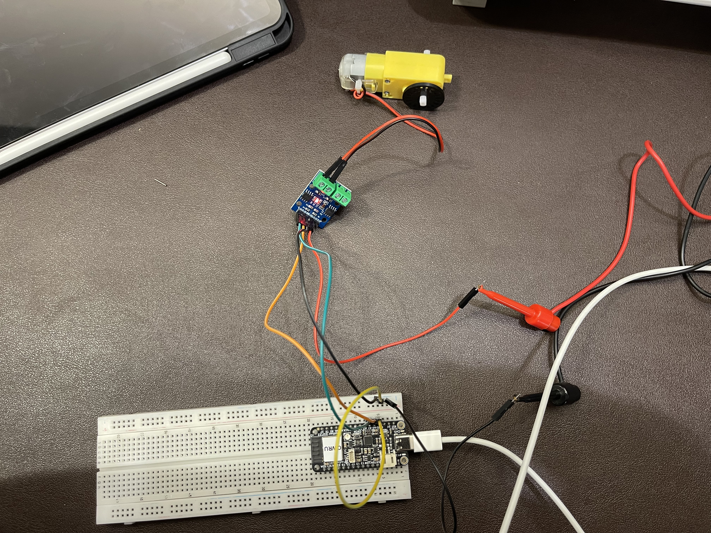
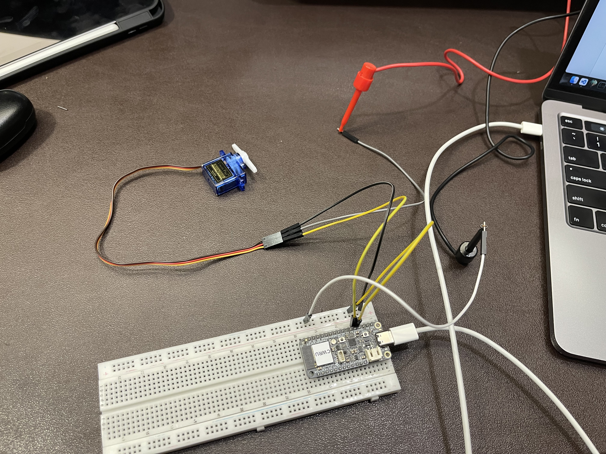

# Lab 4: Adventures with Actuators
### *ECSE 395 — Junior Engineering Design Seminar*

**Name:** Daniel Soriano Ponce
**Date:** September 18, 2026

---

## Purpose

This will be our third assignment working with the ESP32 and has us connecting actuators to the microcontroller. We will be working with and learning about servo motors and DC gear motors (TT motors). Their motions are similar, but they have slight differences.

I will be uploading the code from PlatformIO on a Mac device. 

#### Reference
1. The code to indefinitely make the TT motor run clockwise for 5s, stop for 2s, run counter-clockwise for 5s, stop for 2s can be found in `TT Motor Rotate.cpp`.
2. The code to modify or swap `analogWrite()` and modify the `delay()` can be found in `TT Motor.cpp`.
3. The code to experiment with `minPulseWidth()`, `maxPulseWidth()`, `setPeriodHertz()`, rotation range, and `delay()` can be found in `Servo Motor.cpp`.
4. The code to make the servo motor move to random angles between 0° and 180° with different delays can be found in `Servo Motor Random.cpp`.

## Steps Taken to Complete This Lab
1. Watched Roy's video for Lab 4
2. Followed the instructions in the repository to build the circuit with the TT motor
3. Set the benchtop supply limit to 3V, 0.15 A
4. Connected the power supply to the circuit

### Picture of TT Motor Circuit

4. Built and uploaded code to `TT Motor.cpp` to ESP32
5. Observed behavior of the following value changes:

| What Changed | Changed To | Observation |
|---|---|---|
| Modify `analogWrite()` to different value | `analogWrite(MOTOR_B_1A, 230)` | Dropping to `230` made the motor spin slower. This checks out since `analogWrite()` switches between high and low voltage states, and lowering the `analogWrite()` value lowers that average.|
| Swap `analogWrite()` values | `analogWrite(MOTOR_B_1B, 255)` | Swapping the values changed which driver input gets energized, so the direction of the motor reverses relative to the original |
| Modify the `delay()` | `delay(2000)` | The motor runs for a shorter duration |

6. Followed the instructions and modified skeleton code `TT Motor Rotate.cpp` so the motor runs clockwise for 5s, stops for 2s, runs counterclockwise for 5s and then stops for 2s, then loops this sequence
7. Took a video of `TT Motor Rotate.cpp` running
8. Pushed `TT Motor Rotate.cpp` file
9. Completed extra credit to continously *increase* and *decrease* motor speed in a loop and titled the file `TT Motor EC.cpp`
10. Grabbed the servo motor and built the second circuit with it
11. Used the benchtop DC power supply and limited to 5V, 0.75A
12. Took a picture of the circuit

### Picture of Servo Motor Circuit

13. Uploaded `Servo Motor.cpp` code to ESP32
14. Observed behavior of the following value changes:

| What Changed | Changed To | Observation |
|---|---|---|
| `minPulseWidth()` to different value`` | 500 to 700 | The starting position started inwards now, so the rotation angle that was the baseline was reduced. |
| `maxPulseWidth` | 2500 to 2300 | The servo is sweeping fine, but it's stopping short of being parallel with its original 180° orientation. All that to say, the sweep is visibly narrower. |
| setPeriodHertz() | 50 to 100 | The servo motor is jittering more because the signal is refreshing twice as fast as before |
| Rotation Range | 0-180 to 0-90 | The servo arm only sweeps through a 90° arc instead of executing a full 180° motion. |
| Delay | 15 to 50 | The sweep speed slows down significantly, resulting in a much more gradual step-by-step movement. |

15. Followed the instructions and modified the code in `Servo motor Random.cpp` so the servo moves to random angles between 0° and 180° with different delays.
16. Added comments to explain the changes I made
17. Took a video of the motor running with the custom adjustments
18. Completed Time Reporting and Reflection

---
## Time Reporting and Reflection

**1. How long did it take you to complete this assignment?**
In total, this assignment took me 181 minutes to complete.

**2. What level of difficulty would you associate with this assignment?**
This lab was medium difficulty. 

**3. If medium/high difficulty, what aspect did you find most difficult?**
It was time-intensive and required much more setup compared to previous labs. It also took more time because there were more files to take care of. Typing up this report and formatting it also takes significant time. For this specific lab, fishing for the right functions for `Servo Motor Random.cpp` took so much more time than it should've, but I imagine it would've taken longer if they didn't exist. I'm just glad I found them.

**4. How comfortable do you currently feel with the course content?**
I'm finding that this class is taking up a lot of time whether it's stakeholder-related or lab-related. The technical demand isn't so much a worry. However, the time commitment this class asks for is high, not necessarily the difficulty.

**5. Any additional feedback for the instructors?**
This class is starting to feel disorganized. There are deadlines on our Canvas Calendar that get little to no elaboration in class. Yes, they are mentioned, but they aren't elaborated on, so teams are left confused on what the actual deliverable is. On Canvas, there *are* documents to refer to. However, in this lab, there were typos and extra setup steps that caused friction. I'm noticing more friction than there should be. If the idea is for students to come into lab and get started right away, that's not really what I'm seeing. I would say communicating things ahead of time would help out so much.