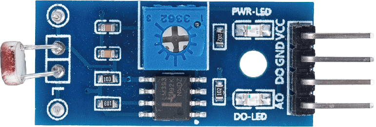
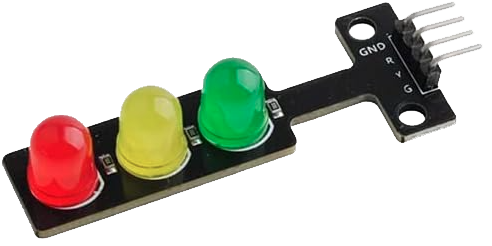
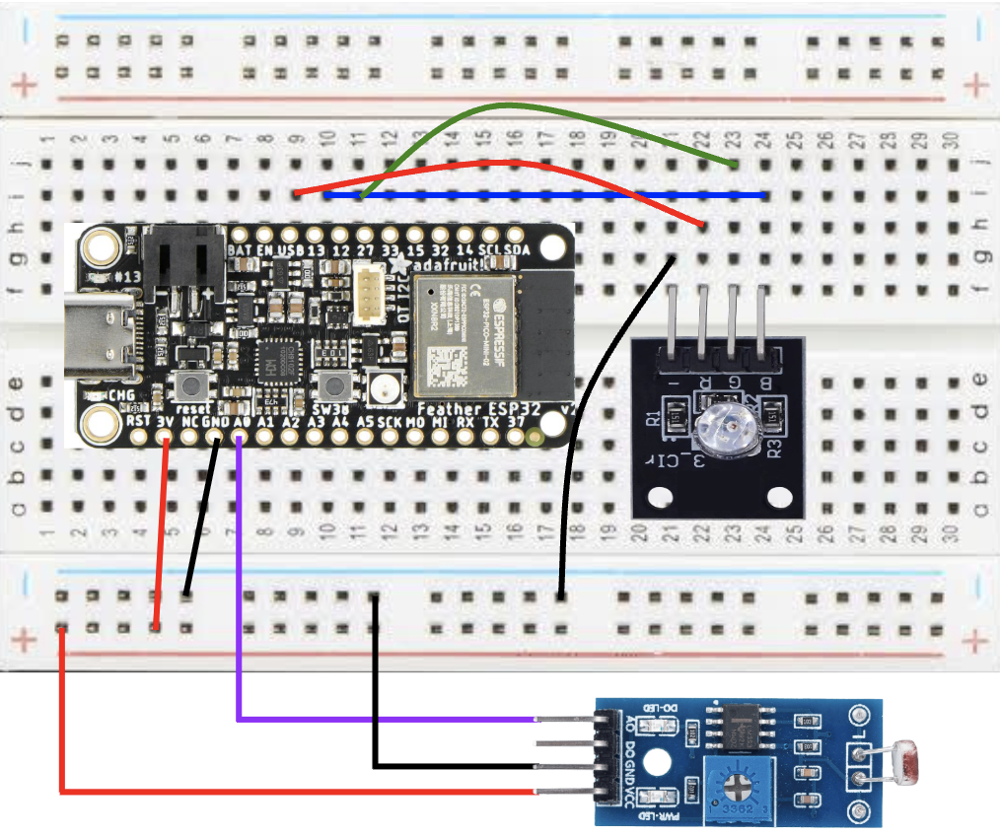
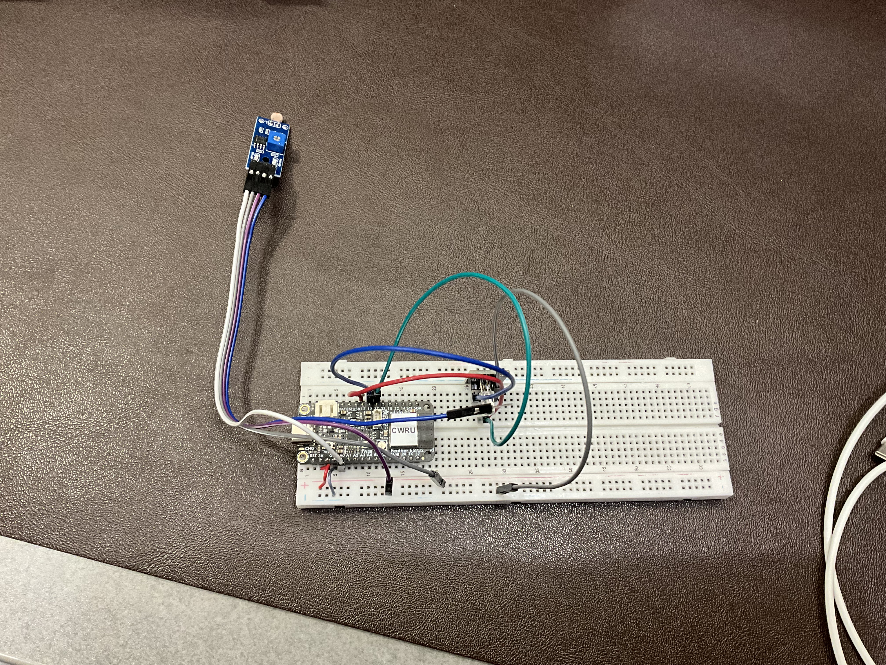

# Lab 5: Sensor-Actuator Integration
### *ECSE 395 — Junior Engineering Design Seminar*

**Name:** Daniel Soriano Ponce
**Date:** September 25, 2026

---
## Purpose
This will be our last assignment working with the ESP32 and has us intregrating sensors and actuators. In this lab, we have the freedom to work with a sensor and an actuator of our choosing, the purpose being to create a "smart system" of your design.

I will be building and uploading the code to the ESP32 via PlatformIO on my Mac device. The chosen sensor and actuator in this lab are a photoresistor and an RGB LED module, respectively.

## More on Parts (from [SunFounder Universal Maker Kit](https://docs.sunfounder.com/projects/umsk/en/latest/index.html))
### Photoresistor Module

The photoresistor module can detect the intensity of light in the environment. Some practical uses include adjusting the brightness of a defice or activating a light switch.

In the dark, a photoresistor can have several megaohms of resistance (MΩ) and have a few hundred ohms of resistance in the light. Basically, the module changes resistance in response to different light intensities.

This specific module comes with four pins:
- VCC: This is the positive power supply input.
- GND: This is the standard ground connection.
- DO: This is the digital output with LOW and HIGH values.
- AO: This is the analog output where the stronger the light, the lower the output value, and the weaker the light, the higher the output value.

To me, DO wouldn't produce enough resolution for a three-light system, so it was left unconnected. This lab needed three distinct states (bright, regular, dark) and the binary states of HIGH or LOW wouldn't allow for that.

### RGB LED Module

In this image, the LED in the middle emits a yellow color. However, the only difference from the module in the image and the one used in the circuit is that the YELLOW color is actually BLUE. 

There are two primary ways to control the module, the first being digital inputs and the other being pulse-width modulation. My interest was not in varying the brightness of the LED but in using the HIGH and LOW signals to affect the color emitted.

## Desired Behavior
As stated before, this system pairs a photoresistor module with an LED RGB module to create a light-level indicator. The intent is for the photoresistor to measure the surrounding light intensity through its analog output pin, which is read via `analogRead()`. A variable voltage output from the photoresistor's A0 pin will return a value from 0-4095.

This module's AO signal is inverted, which was discovered while testing. In any case, the readings will evaluate two threshold values and drive a specific LED color accordingly.
* Green will light up when the reading falls below 220, indicating bright ambient light.
* Blue will light up when the reading falls between 220 and 700, indicating regular ambient lighting.
* Red lights up when the reading exceeds 700, which would indicate a dark environment.

If not already clear, only one LED is going to be active at any given time. This is because the microcontroller prevents overlapping states, and the system will re-evaluate the light level roughly 5 times per second. The `200ms` delay makes the human eye perceive the state recognition as immediate.

As for the thresholds, they were determind empirically by just watching live readings and testing the room's lighting. What also helped produce the two cutoffs was changing locations also helped pinpoint the exact threshold numbers. 

#### Reference
1. The code to --- can be found in `main.cpp`.

---

## Circuit Diagram and Wiring

The circuit made at Glennan versus the one in the diagram is not one-to-one, the aformentioned color difference being the only distinction. 
* A wire runs from the ESP32's 3.3 V pin to the breadboard's `+` rail.
* A wire runs from an ESP32 GND pin to the breadboard's `-` rail.
* Both modules draw their power from these shared rails.

The photoresistor module uses 3 of its 4 pins:
| Pin | Wired To |
|---|---|
| VCC | Breadboard's `+` rail |
| GND | Breadboard's `-` rail | 
| DO | Unconnected |
| AO | Pin A0 |

The LED RGB module uses all 4 pins:
| Pin | Wired To |
|---|---|
| GND | Breadboard's `+` rail |
| R (Red) | Pin 13 | 
| G (Green) | Pin 27 |
| B (Blue) | Pin 12 |

In all, this circuit uses 7 power jumper wires between components plus the 2 rail-setup wires from the ESP32 itself.

---

## Steps Taken to Complete This Lab
1. First, I reviewed the lab instructions, which paid off since I avoided picking a combination that was not permitted.
2. Both modules chosen were picked quite randomly; I just knew I wanted to work with diodes.
3. I was unsure with how to use both of them, so I referred to the Sunfounder Website, which helped tremendously.
4. After reading up on how each module worked, I planned out the wiring and made sure the shared power rails were consistent across both modules.
5. I built the circuit using the labels on each module's pin as a guide.
6. I wrote `main.cpp` code to read the analog output of the photoresistor and convert it into three light-level categories.
7. While testing, I discovered that the AO signal was inverted, meaning a brighter light produced a lower reading rather than a higher one, so I had to rework my threshold logic.
8. The other step that helped me calibrate accurate threshold values was using the Serial Monitor to observe live readings under different lighting conditions.
9. I ran into a short-lived build error where functions like `digitalWrite()` and `Serial` were undefined, which was because `#include <Arduino.h>` was missing.
10. When everything behaved as it should, I took a photo of my finished breadboard setup and recorded a short video showing the LED changing color under a closed fist, dim lighting, and a flashlight from my iPad.
11. Lastly, I finished up writing this report.

---

## Time Reporting and Reflection

**1. How long did it take you to complete this assignment?**
In total, this assignment took me 71 minutes to complete.

**2. What level of difficulty would you associate with this assignment?**
This lab was medium difficulty. 

**3. If medium/high difficulty, what aspect did you find most difficult?**
The time-consuming aspect of these labs are most difficult to work with. Each lab has its own demand and most of it stems from inexperience with these devices and modules that force me to take time to familiarize myself with them. 

**4. How comfortable do you currently feel with the course content?**
Up until now, I feel very comfortable with the course content. Soon, however, the course will look differently, so I don't want to speak too soon. That said, I'm exicted for what's to come!

**5. Any additional feedback for the instructors?**
None.