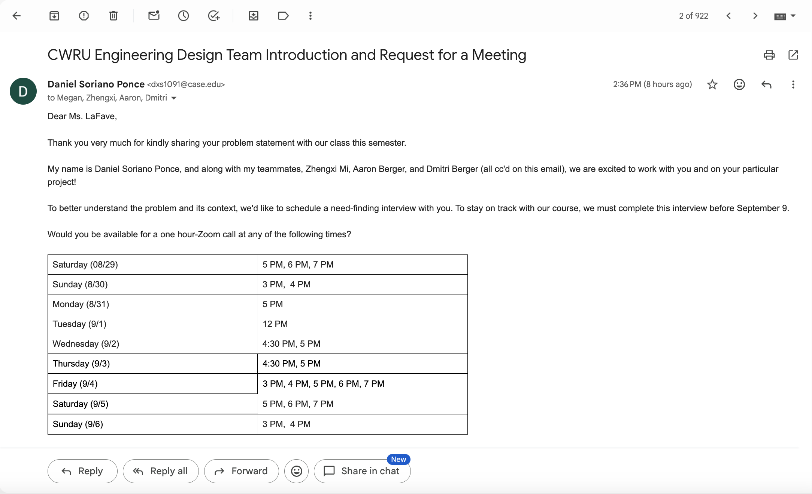

# Week 1 — Project Log
### *Team Fresh — Semester Project*

---

## August 27, 2026

- Our team was formed, assigning myself and my peers to work together for the semester (8/27)
- Ranked our preferred problem statements, from most to least interested (8/27):
  1. I have difficulty distinguishing the direction that loud sounds originate from.
  2. Our baby gets too close to the stairs, so I want to be notified of it without scaring the baby.
  3. I want an automated way to score my baseball league's pitch, hit, and run competition.
  4. I need to keep my cat entertained while I'm at work.
  5. I forget to close my toilet cover before flushing.
  6. I frequently forget to close the toilet cover before flushing.
  7. I want a bird feeder that will only dispense food for birds and not deer.
  8. I always forget clothes in washing machine/dryer.
- Used a scheduling tool to find overlapping availability among the team, to offer time slots for a **one-hour need-finding interview** with the stakeholder (8/27)
- I, **Daniel Soriano Ponce**, drafted the outreach email to the stakeholder (8/27)
- Entered the agreed-upon time slots into the email template and sent it for team approval (8/27)

**Stakeholder email confirmation:**

---

## August 28, 2026

- Created our **team contract** during Friday's lab session, adding a fourth, more technical role to the standard set, anticipating that quality code will be important to our success (8/28)
- Assigned team roles based on individual strengths and initiative shown at Friday's lab (8/28):
  - **Team Leader**
  - **Secretary**
  - **Document Manager**
  - *(**Software Manager** — added by our team)*
- Expanded our **Mitigation Plan** with additional contingencies, even though we don't currently foresee issues among teammates (8/28)
- Chose our team name: **Team Fresh** — inspired by our upcoming work on the stakeholder's washing machine/dryer problem (8/28)
- Completed Lab 1's Markdown and GitHub assignment (8/28)

---