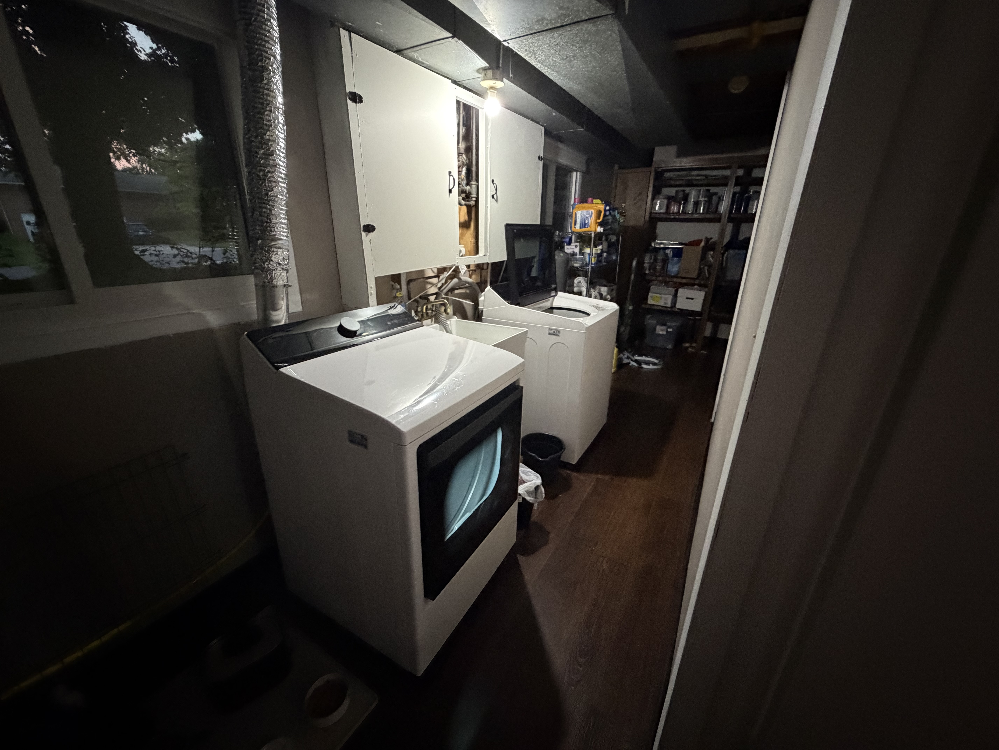
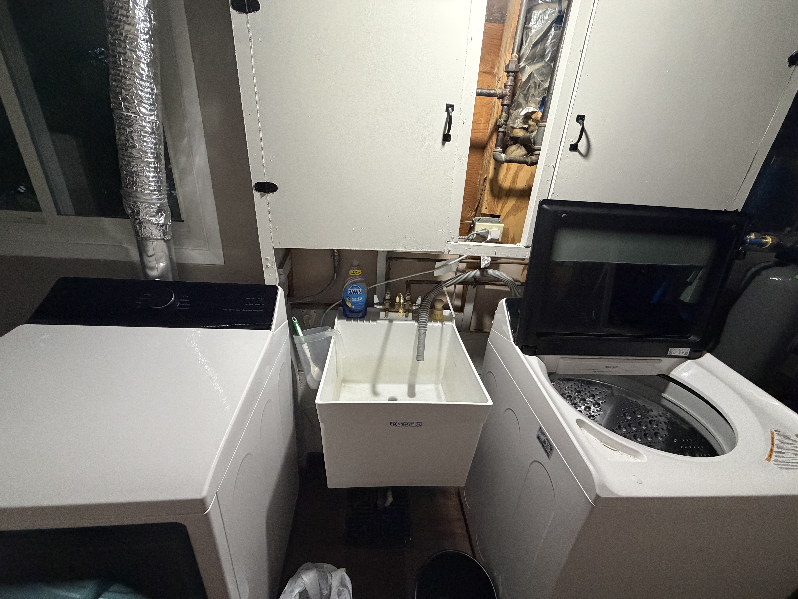
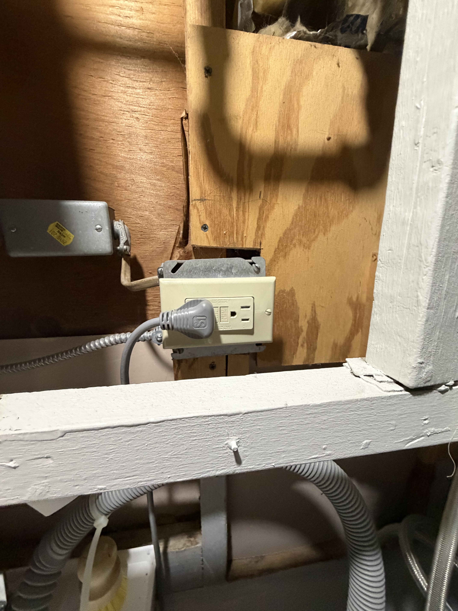
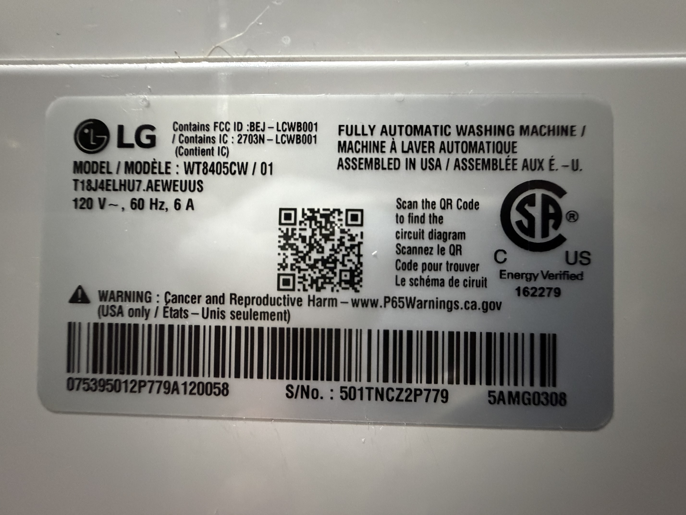

# Week 2 — Project Log
### *Team Fresh — Semester Project*

---

## September 4, 2026

### Individual contributions
- Received a response from Megan, the stakeholder, offering times for us to compare on the schedule we sent her in the first email. (9/3)
- Sent an invite link to Megan's work email (as requested) and the rest of my team. (9/3)
* Moving forward, she has asked that we used her work email to make she sees emails on a timely basis.
- Drafted a set of questions to ask in the need-finding interview, which (9/4)
- Completed Lab 2 (9/4)
- Started need-finding session link at 6:57 PM (9/4)
- After everyone is in attendance at 6:58 PM, we decide to start early. (9/4)
- When the meeting ends at 8 PM, I followed up with Megan to retrieve necessary items, including images of the laundry area and some unanswered questions she was unsure of. (9/4)

#### Images

### Group Contributions
1. Decided with Megan on a meeting for Friday (9/4) at 7 PM. (9/3)
2. After everyone is in the meeting at 6:58 PM, we decide to start early. (9/4)
3. Complete the interview (9/4)

Meetings notes, written by Dmitri Berger: (9/4)

* Has less trouble moving clothes from washer to dryer
Dryer beeps, but is downstair
* Can leave clothes in the dryer for over a day
* Can either hear it but too busy to attend it (and forgets), other times doesn’t hear it at all (out of range)
* Is often away during the drying cycle (e.g. when leaving for work)
* Too busy to keep track of and always attend laundry
* Is in a house (not apartment or loft or dorm), they think it would be easier otherwise
* Has a cat and a dog, aren’t bothered by existing dryer beeps
* Cat’s preferred area is the laundry area, is often near the machines while they are active, so probably unbothered
* Cat is unlikely to climb on things or knock things off the machines, would only minimally investigate
* Dog would be bothered by sound
* Black dryer - washer loads from the top, dryer is side-loaded with a solid door. Have to physically open the door of the dryer to know if there is clothing in it.
* There is a sink between the machines, each are pushed up against the wall
* Usually it’s harder to remember during the busiest weeks
* Tends to ignore reminders, and forgets that they went off
repeated/continuous reminders could work
* Some way to always know if there is something in the dryer
* Pain point is that laundry in the dryer isn’t available, especially towels
* Likes towels heated so they can be fluffed
* Also have to spend extra time when doing subsequent loads emptying forgotten loads
* Disruption isn’t too bad, but missing towels or clothes when they are needed hurts (4/10)
* Would rather have a physical device as a reminder than a phone service/communication - phone is frequently on silent during work
* Could do with something in the house closer to the living room or kitchen (no smart devices mentioned/available)
* Light could work better than repeated noise; can always be seen, best if can be placed in view of front door when returning from work
* Maybe two microcontrollers with wifi communicating?
* Additional step during dryer would be too cumbersome/easy to forget - only way to avoid detection mechanism would be to cover the start button with something
* Uses different settings depending on the load and amount (e.g. delicates) - time is not invariant
* Communciation: Is ok with follow-up emails if there is no response within two days
* Most easily forgets sheets, followed by towels, happens less with clothes
* Only big loads tend to be towels
* Tends to dedicate weekends to laundry, is usually home on sundays, but loads tend to build up during weekdays
* Usually does laundry as hamper begins to get full
* Hamper is not a good enough reminder, needs a reminder for every kind of laundry
* Would still prefer a single status indicator (no need to differentiate with lights)
* Text indicator may be better than a light
* Has a lot of outlets in the kitchen, plugged in to the wall is better than a battery
* Few to no outlets near the laundry machines, battery-operated could work here
* Has batteries to spare
* There is a plug right behind the dryer and to the right - grounded (three prong)
* Kitchen has space for a small screen/display
* Not very many aesthetic concerts, just nothing obnoxiously big
* Laundry room is in a hallway, there is empty wall space
* Not too bothered by setup/attaching things
* Would prefer for the device not to be on top of the machine, as they put clothes, towels, baskets on top
* Piping on the wall behind the machines, cabinet drawers hiding some of the piping
* Could be better than the wall in front of the dryer, where a sensor could be obstructed by cat
* There is a furnace close to the machines, so there is ambient noise in the area
* Cat is also noisy
washer is extremely loud especially at the end of the cycle, is often reminded just from that
* Is an electric, non-condensing dryer
* No setup changes in the laundry room anticipated
* Machines are new (2024), hopefully won’t break soon
* Laundry room does not have a history of flooding
* Split basement - house has mid-level, upstairs, and downstairs (laundry)
* Cleaning supplies are in the basement/laundry room, is also a storage location for other miscellaneous items - user is frequently there retrieving/storing things, taking care of the cat
* Laundry is often done on cleaning days (weekends), user puts in load while cleaning (is frequently in and out of room while cleaning)
* Washer is loud enough to hear, usually starts another washer load while the dryer is going
* Sometimes just leaves the clothes from the dryer in the laundry room in a basket
* Laundry on weekdays is usually put into the dryer at night
* May leave clothes in the washer over the workday, can forget to switch the washer contents to the dryer on those days
* Forgetting both washer and dryer is possible on those days
* Is okay with redundant reminders on double-load days
* Could get to the next load sooner rather than later
* Laundry room is usually dark (light off)
* Windows are in the basement, usually open (doens’t get too dark in the days)

