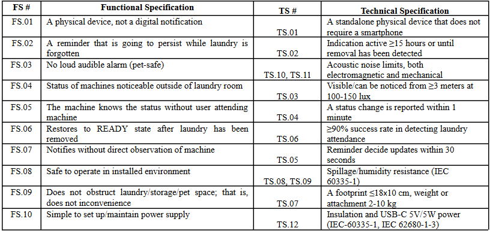
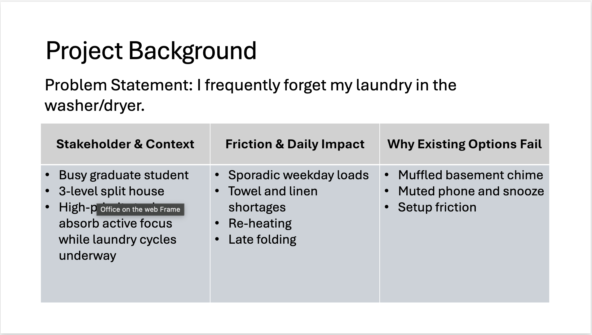
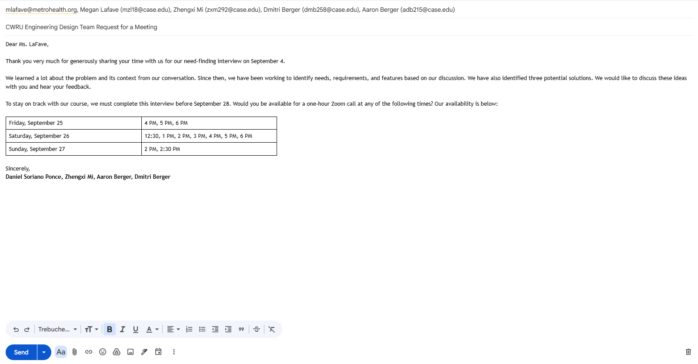

# Week 4 — Project Log
### *Team Fresh — Semester Project*

---

## September 18, 2026

### Individual Contributions
- Created team's Functional and Technical Specs submission document (9/13)
- Formatted it accordingly (9/13)
- Shared it with team (9/13)
- Started the `.pptx` presentation document and shared it with rest of team (9/14)
- Completed TS to FS Mapping Table (9/14)

- Proof-read the Functional and Technical Specs submission document top-to-bottom and rerouted TS.09 to FS.08 (9/14)
- Completed Slide 1 that had to do with project background and context (9/15)

- Created when2meet to team to get availability for concept review
Email: could be screenshot (9/18)
- Drafted email using template to schedule stakeholder concept review, shared with rest of team for suggestions/approval (9/18)

### Group Contributions
- Presented Need Finding Presentation with rest of class (9/16)
- Gave availability for concept meeting with Megan (9/18)