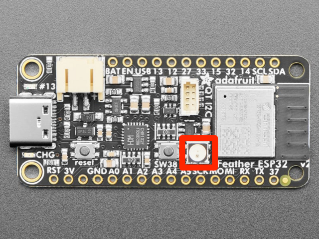

# Week 7 — Project Log
### *Team Fresh — Semester Project*

---

## October 9, 2026

### Individual Contributions
- Completed System Overview in System Architecture and Prototype Plan, answering the following questions: (10/5)
1. What problem are you solving?
2. Who is your stakeholder and user?
3. What are the top 3–5 system-level requirements?
4. What feedback from your stakeholder influenced your concept selection?
- Included two key uncertainties having to do with Vibration Thresholding Across Various Cycles and Power Optimization and Reporting Latency. (10/5)
- Made two assumptions explicit having to do with (1) the correlation between a door opening and the machine actually being attended and (2) power availability. (10/5)
- Utilized the ring to emit a soft, ambient glow visible from at least 3 meters away under 100-150 lux indoor lighting in an attempt to make the stakeholders visibility of unattended laundry more instant. (10/7)
- Planning to program the NeoPixel hub to remain subtle initially and then escalate to a slow, 1 Hz pulsing breath if completed laundry remains unattended past 8 hours; this directly matches Megan's full workday and commute schedule. (10/7)

- Worked with Mi to develop Prototype 2, using readings from the Ultrasonic Sensor Module, Vibration Sensor Module, and the DHT11 Temperature and Humidity Sensor Module to trigger different outputs on the OLED display. (10/8)
- Tested sensor compatibility with Mi (10/8)

For those curious, the code is in this **[repository](https://github.com/ASquared1089/F26-ECSE395-Team-8/tree/main)**.

- Prepared a proposal for an addition (or amendment) to display design having to do with NeoPixel library. (10/9)
- Planning Prototype 3 that will attempt to feature D Flip Flops to focus on (efficient) power management, fine-tuning by simulating the stakeholder's typical routine, and marrying together the wireless connectivity with the Basement and Upstairs systems. (10/9)

### Group Contributions
- Collaborated to complete System Architecture and Prototype Plan (10/5)
- Half of team (Aaron and Dmitri) focused on and completed Prototype 1 (10/9)
- Half of team (Mi and myself) focused on and completed Prototype 2 (10/9)